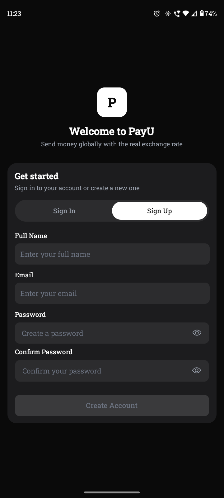
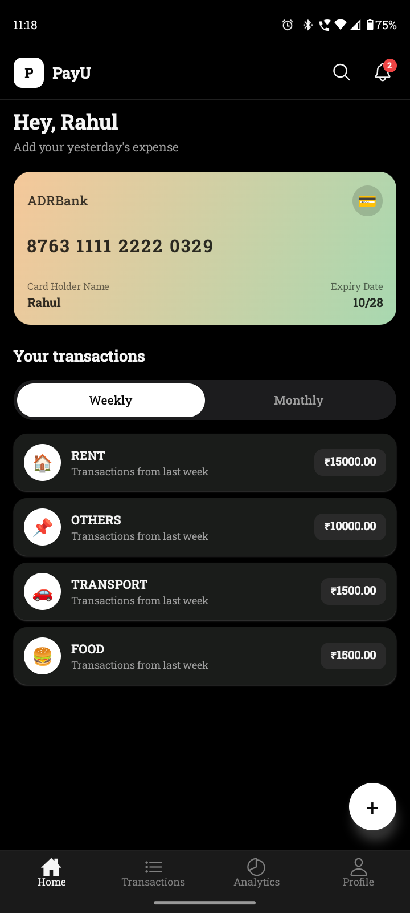
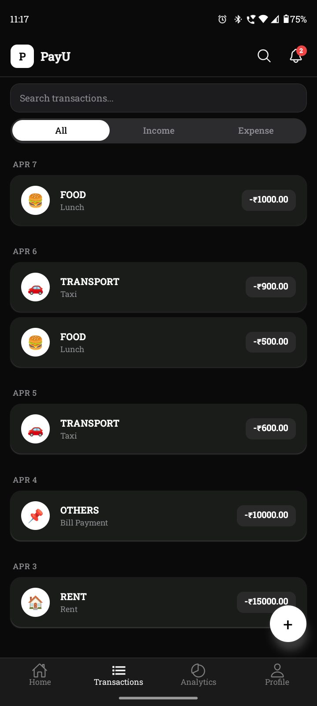
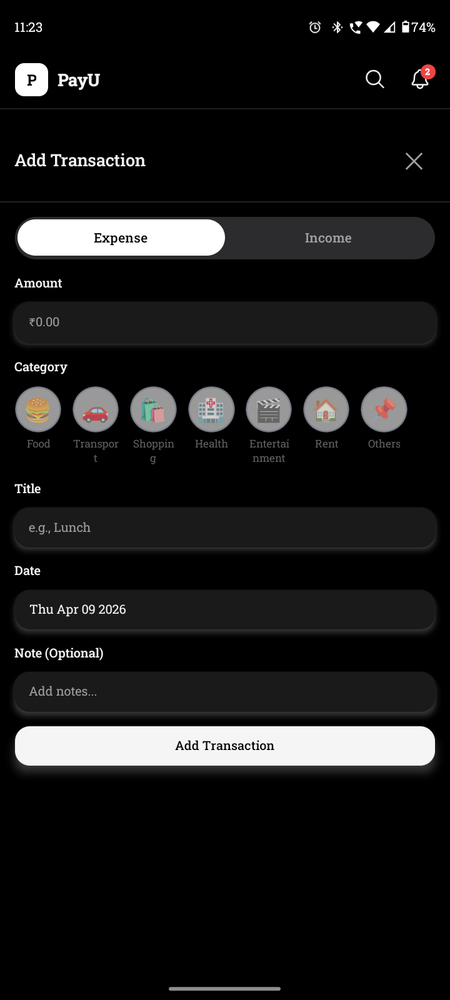
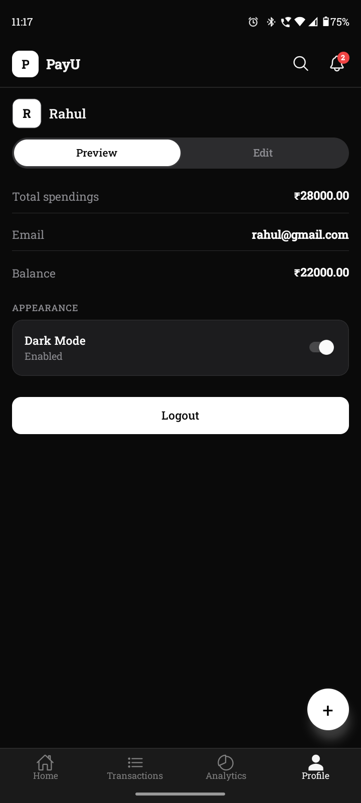

# PayU 💸

PayU is a modern, beautifully designed personal finance and expense tracking application built with React Native and Expo. Manage your income, track your daily expenses, and visualize your financial analytics seamlessly on both iOS and Android.

## ✨ Features

- **Transaction Management**: Add, edit, and delete daily income and expense transactions.
- **Smart Analytics**: Visualize your monthly spending habits with interactive bar charts and data summaries.
- **Dynamic Theming**: Full support for both Light and Dark modes with responsive contrast, typography, and dynamic shadow elevations.
- **Categorization**: Built-in and customizable categories to group your financial activities.
- **Local Persistence**: Fast and reliable state management using Zustand with local storage hydration.
- **Accessibility**: Screen-reader friendly components, semantic labels, and focus states for inclusive usability.
- **Haptic Feedback**: Meaningful tactile responses for primary actions, success states, and warnings.

## 📸 Screenshots

<p align="center">
  
  
</p>
<p align="center">
  
  
</p>
<p align="center">
  
  
</p>

## �🚀 Getting Started

### Prerequisites

- [Node.js](https://nodejs.org/en/)
- [Expo CLI](https://docs.expo.dev/get-started/installation/)
- iOS Simulator or Android Emulator (or a physical device with the [Expo Go](https://expo.dev/go) app)

### Installation

1. **Clone the repository**

   ```bash
   git clone https://github.com/RahulKeshri1/PayU.git
   cd PayU
   ```

2. **Install dependencies**

   ```bash
   npm install
   ```

3. **Start the development server**
   ```bash
   npx expo start
   ```

## 🛠 Tech Stack

- **Framework**: [React Native](https://reactnative.dev/) & [Expo](https://expo.dev/)
- **Routing**: [Expo Router](https://docs.expo.dev/router/introduction/) (File-based routing)
- **State Management**: [Zustand](https://github.com/pmndrs/zustand)
- **Icons**: [Ionicons](https://ionic.io/ionicons)
- **Date Parsing**: [date-fns](https://date-fns.org/)

## 📱 Project Structure

```text
app/                 # Expo Router screens and layouts
  (tabs)/            # Bottom tab navigation (Home, Analytics, Transactions, Profile)
components/          # Reusable UI components (Header, CustomAlert, etc.)
constants/           # Theme definitions, colors, typography, and layouts
hooks/               # Custom React hooks (useHaptics, useTheme, etc.)
store/               # Zustand state stores (auth, transactions, categories, etc.)
utils/               # Utility functions for date parsing, currency formatting, etc.
```

## 🤝 Contributing

Contributions, issues, and feature requests are welcome! Feel free to check the [issues page](https://github.com/RahulKeshri1/PayU/issues).

## 📄 License

This project is licensed under the MIT License.
